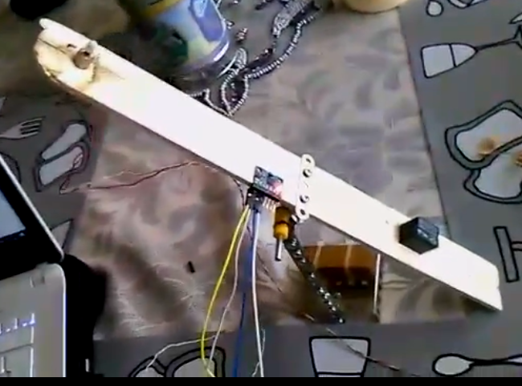
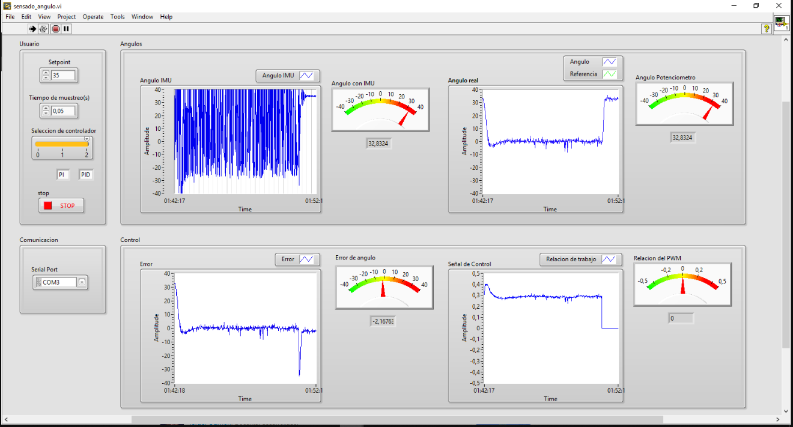

# PID control of VTOL system
<!-- markdownlint-disable MD033 -->
<!-- markdownlint-disable MD047 -->
## 1. Prerequisites

Have installed on your computer LABVIEW, Arduino plugin for LABView.

## 2. Materials used

-DC Motor

-Driver L298

-Potenciometer

-Arduino

-IMU

## 3. Description

This project has a PI and PID control for VTOL system. The VTOL system can see in the next figure.

  

And The interface is ubicated in the Program folder can see in the following figure.

  

The GUI and Control system was designed in LABView, and the Arduino is used as data add-on card. The control positions the system at a specific angle, the sensor that measure this angle is the potenciometer and the signal control (PWM) moves the motor with driver L298.

## 4. Results

The next animation you can see how the VTOL is positioned at a specific angle.

  

## 5. Contact with me

Linkedin: <www.linkedin.com/in/juan-balseca-pinto-9117b397>